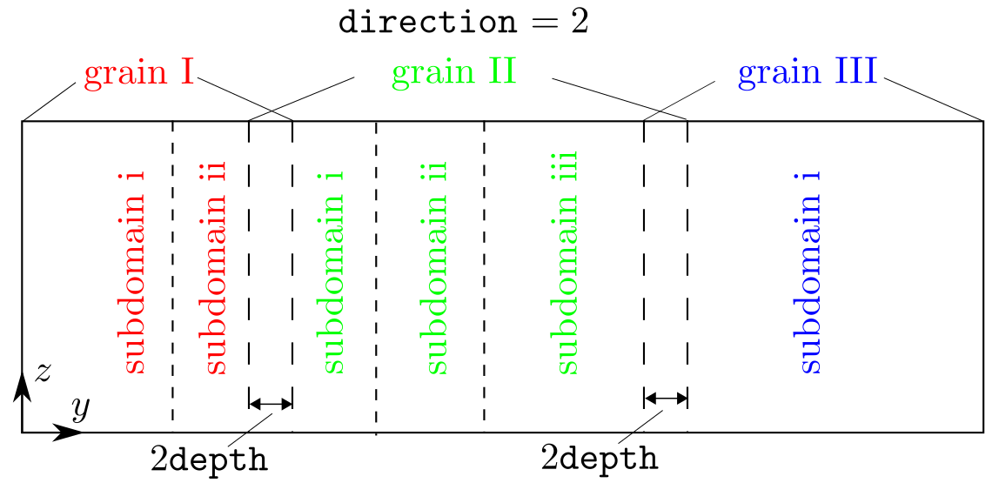

## grain_dir

### Syntax

	grain_dir direction overlap

* `direction` = _1_ or _2_ or _3_

* `overlap` = real number

### Examples

	grain_dir 1 0.1
	grain_dir 2 0.2

### Description

This command sets the grain stack direction and the overlap between adjacent grains along that direction, as shown in the figure below:

`direction` can be _1_, _2_, or _3_, corresponding to the _x_, _y_, or _z_ directions, respectively.

`overlap`, in units of the component of the [lattice periodicity length vector $$\vec{l'}_0$$](../chapter8/lattice-space.md) along the `direction`, sets the overlap distance between adjacent grains along the `direction`, as shown in the figure above. It is used to adjust the relative position along a certain direction between adjacent grains to find the energy minimized grain boundary structure. If `overlap` is a large positive real number, some atoms from adjacent grains may be too close to each other. In this case, one may use the _cutoff_ style in the [modify](modify.md) command to delete some atoms that are within a certain distance from others.

Note that the `direction` is also the [subdomain](subdomain.md) stack direction if [`subdomain_number`](subdomain.md) > 1 even when there is only one grain, i.e., [`grain_number`](grain_num.md) = 1. Since there is no overlap between adjacent subdomains within the same grain, `overlap` becomes irrelevant when [`grain_number`](grain_num.md) = 1.

### Related commands

This command is relevant when [`grain_number`](grain_num.md) > 1 or [`subdomain_number`](subdomain.md) > 1.

This command becomes irrelevant when [`boolean_restart`](restart.md) = _t_, in which case there is no need for the grain information.

### Related files

`box_init.f90` and `model_init.f90`

### Default

	grain_dir 3 0.
