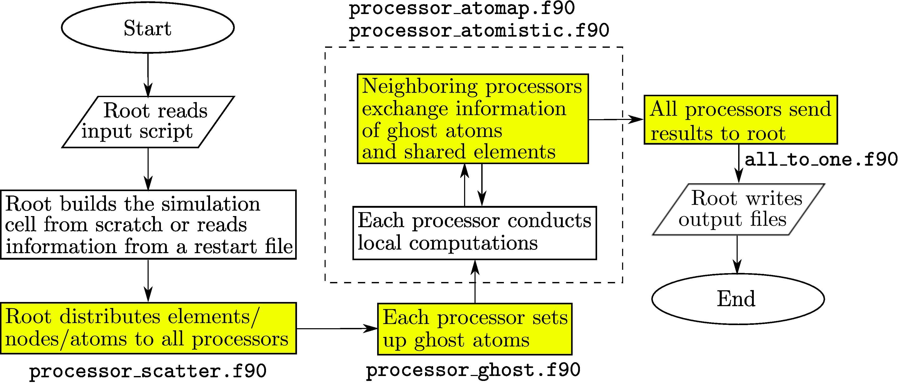

Among the three parallel algorithms commonly employed in atomistic simulations — atom decomposition (AD), force decomposition (FD), and spatial decomposition (SD), SD yields the best scalability and the smallest communication overhead between processors. Unlike AD and FD, the workload of each processor in SD, which is proportional to the number of interactions, is unfortunately not guaranteed to be the same. In CAC, the simulation cell has nonuniformly distributed integration points (in the coarse-grained domain) and atoms (in the atomistic domain), such that the workload is poorly balanced if one assigns each processor an equally-sized cubic domain as in full atomistics. This workload balance issue is not unique to CAC, but is also encountered by other concurrent multiscale modeling methods.

The PyCAC code employs the SD algorithm in which the load balance is optimized, as shown in the figure below which is adapted from Fig. 5 of [Xu et al., 2018](http://dx.doi.org/10.1557/jmr.2018.8).

||
|:--:|
|Parallel CAC simulation scheme. Procedures that do not exist in the [serial CAC simulation scheme](scheme.md) are highlighted in yellow. Note that (i) in the serial scheme, the root processor does everything and (ii) the two procedures in the dashed box are conducted back and forth until the output begins.|