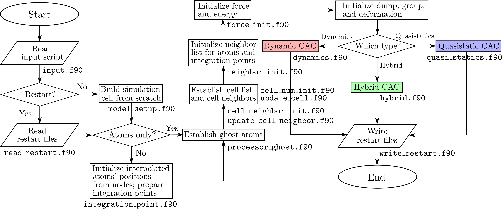
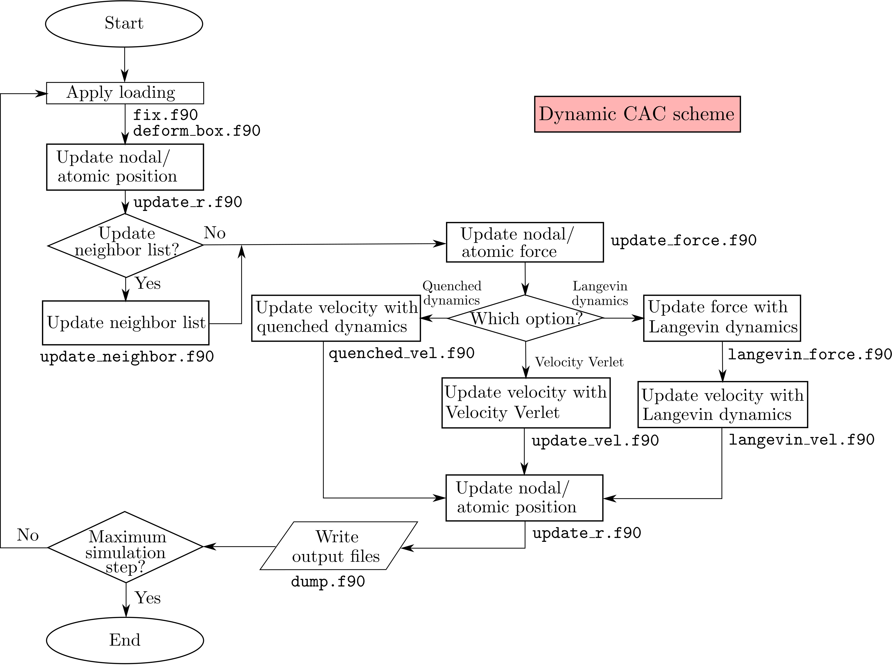
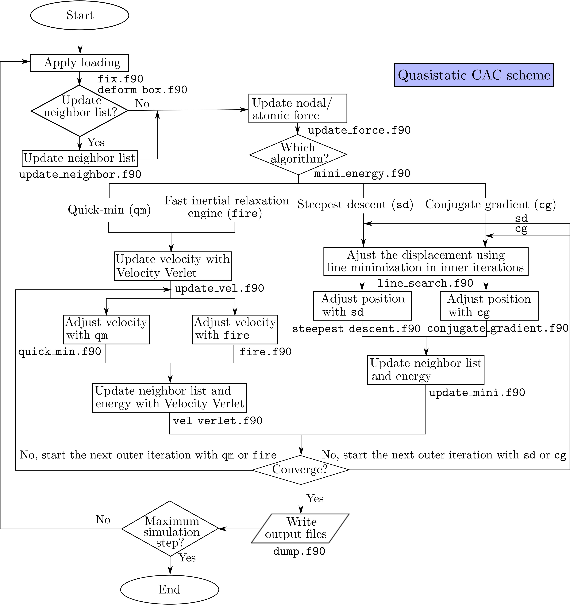
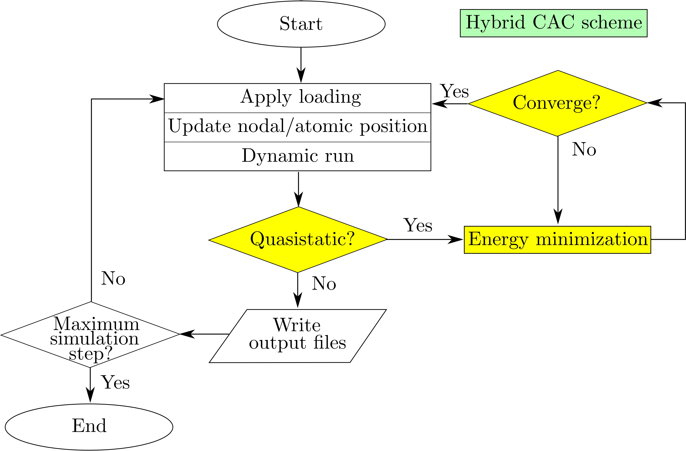

A flowchart of the CAC simulation scheme based on [spatial decomposition](parallel.md) is presented below:

where there are three types of CAC simulations: dynamics, quasistatics, and hybrid, specified by the [simulator](../chapter-5/simulator.md).

In CAC simulations, the elements/nodes/atoms information can either be created from scratch (`model_setup.f90`) or read from the `cac_in.restart` file (`read_restart.f90`), depending on the parameters in the [restart](../chapter-5/restart.md) command.

The dynamic CAC scheme is

The quasistatic CAC scheme is

The hybrid CAC scheme is

All these four figures are respectively adapted from Fig. 1, Fig. S1, Fig. S2, and Fig. 2 of [Xu et al., 2018](http://dx.doi.org/10.1557/jmr.2018.8). More information of the dynamic and quasistatic CAC can be found in the [`dynamics`](../chapter-5/dynamics.md) and [`minimize`](../chapter-5/minimize.md) commands, respectively.