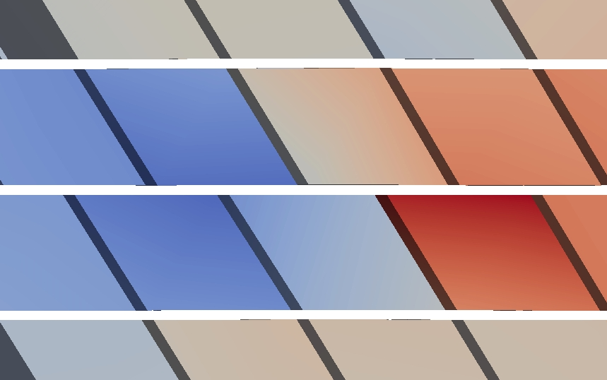

FCC Al, [Mishin EAM potential](http://dx.doi.org/10.1103/PhysRevB.59.3393), 2197 atoms per element in the coarse-grained domain. Results using larger models and/or in other metals are published in [Xu et al., 2015](http://dx.doi.org/10.1016/j.ijplas.2015.05.007) and [Xu et al., 2016](http://dx.doi.org/10.1016/j.jmps.2016.08.002).

In the figures below, the atoms that fill in the jagged interstices are not shown for a better visualization of the elements; the nodes are colorred by the in-plane shear stress. Langevin dynamic simulation at 10 K is carried out, with periodic energy minimization using the conjugate gradient method.

### Edge dislocation

The figure below and the <a href="edge.log" target="_blank">log file</a> are produced using the <a href="edge.in" target="_blank">input file</a> and rendered by [ParaView](../../chapter-6/paraview.md).

### Screw dislocation

The figure below and the <a href="screw.log" target="_blank">log file</a> are produced using the <a href="screw.in" target="_blank">input file</a> and rendered by [ParaView](../../chapter-6/paraview.md).

### $30^\circ$ mixed type dislocation

The figure below and the <a href="mixed30.log" target="_blank">log file</a> are produced using the <a href="mixed30.in" target="_blank">input file</a> and rendered by [ParaView](../../chapter-6/paraview.md).

### $60^\circ$ mixed type dislocation

The figure below and the <a href="mixed60.log" target="_blank">log file</a> are produced using the <a href="mixed60.in" target="_blank">input file</a> and rendered by [ParaView](../../chapter-6/paraview.md), similar to Fig. 8&#40;c) of [Xu et al., 2015](http://dx.doi.org/10.1016/j.ijplas.2015.05.007).

