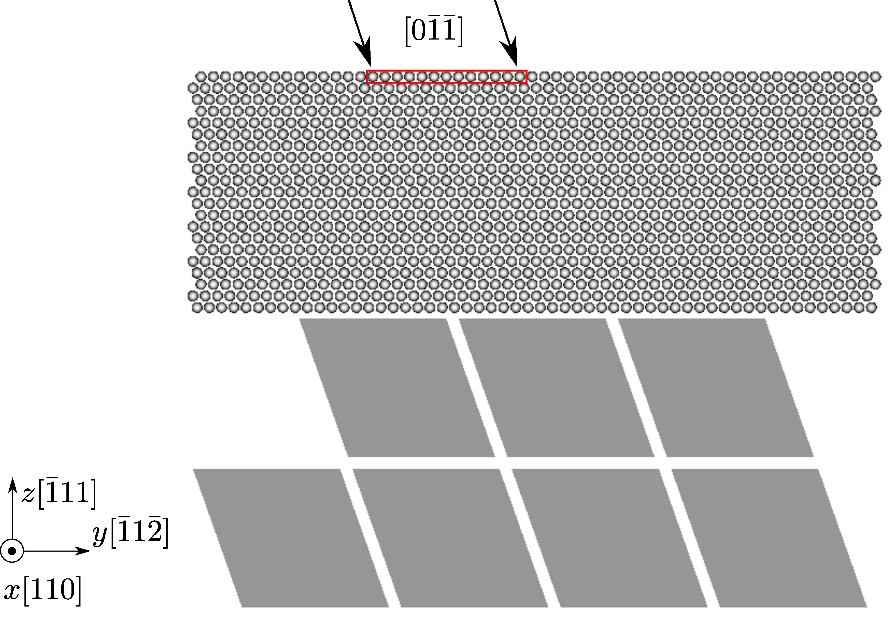
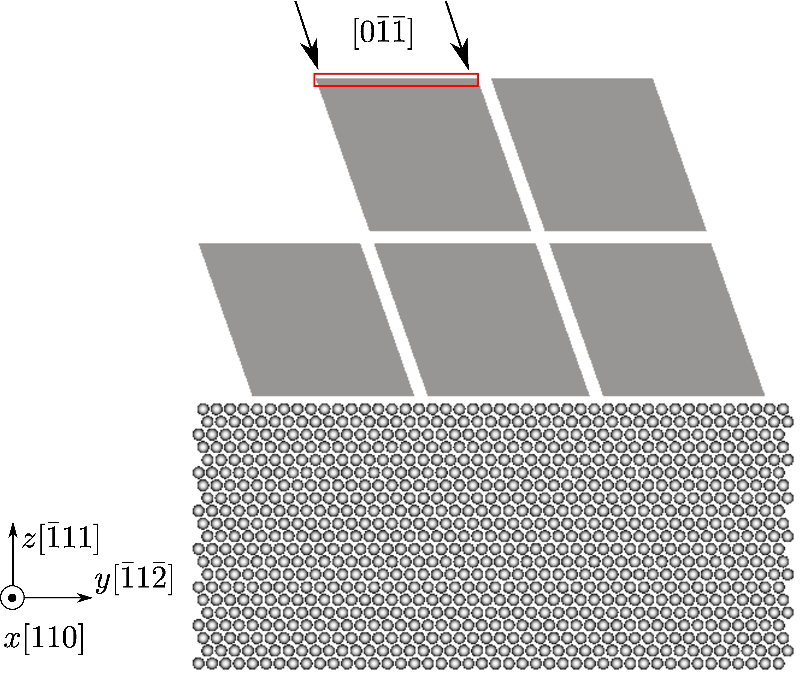

FCC Cu, [Mishin EAM potential](http://dx.doi.org/10.1103/PhysRevB.63.224106), 2197 atoms per element in the coarse-grained domain. Results using larger models are published in Sec. 5.4 of [Xu et al., 2015](http://dx.doi.org/10.1016/j.ijplas.2015.05.007).

### $60^\circ$ mixed type dislocation migration from the atomistic domain to the coarse-grained domain

In the figure below, an indenter (red box) is displaced continously along the $[0\bar{1}\bar{1}]$ direction to nucleate dislocations from the free surface in the atomistic domain. Note that the atoms that fill in the jagged interstices are not shown for a better visualization of the elements, similar to Fig. 14(b) of [Xu et al., 2015](http://dx.doi.org/10.1016/j.ijplas.2015.05.007). The dislocations then migrate into the coarse-grained domain. Energy minimization using the conjugate gradient method is conducted at every simulation step.

The movie below and the [log file](at2cg.log) are produced using the input file](at2cg.in) and rendered by [OVITO](../../chapter-6/ovito.md):

<video style="width:100%" controls>
  <source src="../at2cg.mp4" type="video/mp4">
  Your browser does not support the video tag.
</video>

### $60^\circ$ mixed type dislocation migration from the coarse-grained domain to the atomistic domain

In the figure below, an indenter (red box) is displaced continously along the $[0\bar{1}\bar{1}]$ direction to nucleate dislocations from the free surface in the coarse-grained domain. Note that the atoms that fill in the jagged interstices are not shown for better visualization of the elements, similar to Fig. 14&#40;c) of [Xu et al., 2015](http://dx.doi.org/10.1016/j.ijplas.2015.05.007). The dislocations then migrate into the atomistic domain. Energy minimization using the conjugate gradient method is conducted at every simulation step.

The movie below and the [log file](cg2at.log) are produced using the [input file](cg2at.in) and rendered by [OVITO](../../chapter-6/ovito.md).

<video style="width:100%" controls>
  <source src="../cg2at.mp4" type="video/mp4">
  Your browser does not support the video tag.
</video>