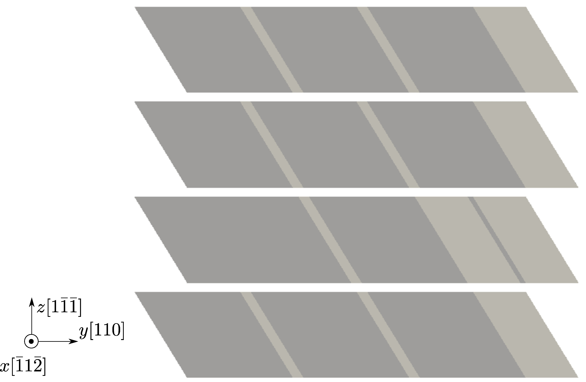

FCC Cu, [Mishin EAM potential](http://dx.doi.org/10.1103/PhysRevB.63.224106), 1331 atoms per element in the coarse-grained domain. Results using larger models are published in [Xu et al., 2017](http://dx.doi.org/10.1016/j.actamat.2016.10.005).

In the figure below, the atoms that fill in the jagged interstices are not shown for a better visualization of the elements. In the Langevin dynamic simulation, a screw dislocation on the $(\bar{1}1\bar{1})$ plane is first created; then subject to a $\gamma_{zy}$ simple shear strain, it crosses slip onto the $(1\bar{1}\bar{1})$.

The movie below and the [log file](cross-slip.log) are produced using the [input file](cross-slip.in) and rendered by [OVITO](../../chapter-6/ovito.md):

<video width="600" controls>
  <source src="../cross-slip.mp4" type="video/mp4">
</video>