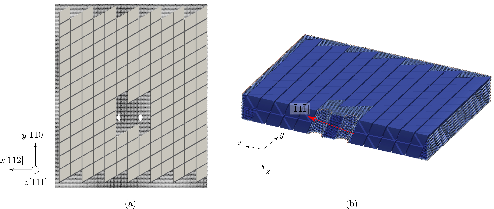

FCC Al, [Mishin EAM potential](http://dx.doi.org/10.1103/PhysRevB.59.3393), 2197 atoms per element in the coarse-grained domain. Results using larger models are published in [Xu et al., 2016](http://dx.doi.org/10.1016/j.scriptamat.2016.06.018) and [Xu et al., 2016](http://dx.doi.org/10.1016/j.jmps.2016.08.002).

In the figure below, two cylindrical holes are carved out to serve as the Frank-Read source. The atoms and elements in figure (b) are colored by the atomic and nodal energy, respectively, and are sliced on the $xz$ plane to highlight the holes. In the hybrid simulation, an edge dislocation is first created between the two holes; then subject to a $\gamma_{zy}$ simple shear strain, it bows out and form a dislocation loop, leaving behind another edge dislocation segment between the two holes.

The movie below and the [log file](frank-read.log) are produced using the [input file](frank-read.in)and rendered by [OVITO](../../chapter-6/ovito.md):

<video width="600" controls>
  <source src="../frank-read.mp4" type="video/mp4">
</video>