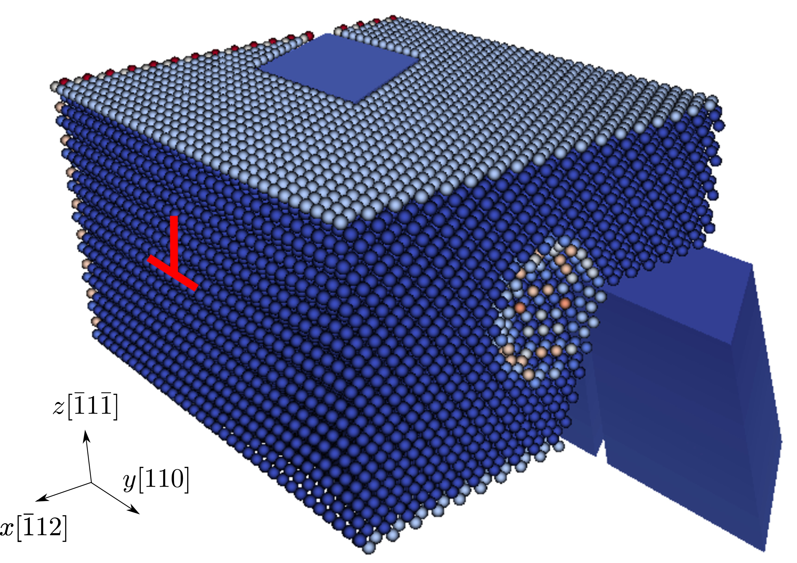
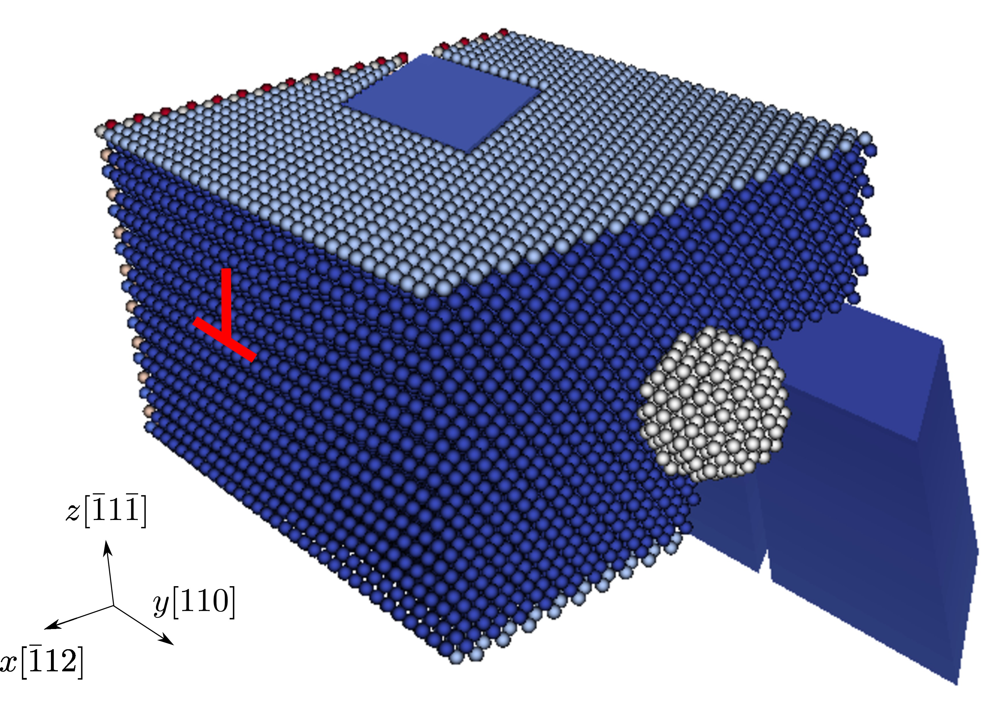

FCC Ni, [Mishin EAM potential](http://dx.doi.org/10.1103/PhysRevB.59.3393), 2197 atoms per element in the coarse-grained domain. The spherical obstacle, with a radius of about 1 nm, is either a void or a precipitate. Results using larger models were presented at the [2017 MRS Spring Meeting](https://mrsspring.zerista.com/event/member/363361).

### Dislocation/void interactions

In the figure below, the atomistic domain is sliced on the $xz$ plane for a better visualization of the void (atoms are colored by the atomic energy in the initial configuration). In the Langevin dynamic simulation, an edge dislocation on the $(\bar{1}1\bar{1})$ plane is first created; then subject to a $\gamma_{zy}$ simple shear strain, it migrates toward the void and bypasses it following the shearing mechanism.

The movie below and the [log file](void.log)are produced using the [input file](void.in) and rendered by [OVITO](../../chapter-6/ovito.md):

<video width="600" controls>
  <source src="../void.mp4" type="video/mp4">
</video>

### Dislocation/precipitate interactions

In the figure below, the atomistic domain is sliced on the $xz$ plane for a better visualization of the precipitate (atoms colored in white). In the Langevin dynamic simulation, an edge dislocation on the $(\bar{1}1\bar{1})$ plane is first created; then subject to a $\gamma_{zy}$ simple shear strain, it migrates toward the precipitate and bypasses it following the Orowan looping mechanism.

The movie below and the [log file](prep.log) are produced using the [input file](prep.in) and rendered by [OVITO](../../chapter-6/ovito.md):

<video width="600" controls>
  <source src="../prep.mp4" type="video/mp4">
</video>

Note that the screw components of the Orowan loop begin to cross slip at about 24 s. The precipitate is not shown here.