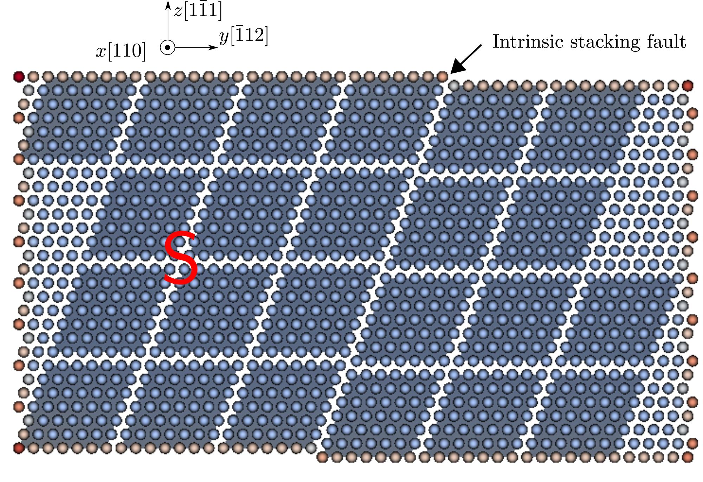

FCC Ag, [Williams EAM potential](http://dx.doi.org/10.1088/0965-0393/14/5/002), 343 atoms per element in the coarse-grained domain. Results using larger models are published in [Xu et al., 2017](http://dx.doi.org/10.3390/cryst7050120).

In the figure below, the atoms that fill in the jagged interstices are not shown for a better visualization of the elements. In the Langevin dynamic simulation, a screw dislocation on the $(1\bar{1}1)$ plane and an intrinsic stacking fault on the $(\bar{1}11)$ plane are first created; then subject to a $\gamma_{zx}$ simple shear strain, the dislocation moves toward and is then transmitted across the stacking fault directly.

The movie below and the [log file](dislocation-sf.log) are produced using the[input file](dislocation-sf.in) and rendered by [OVITO](../../chapter-6/ovito.md):

<video width="600" controls>
  <source src="../dislocation-sf.mp4" type="video/mp4">
</video>