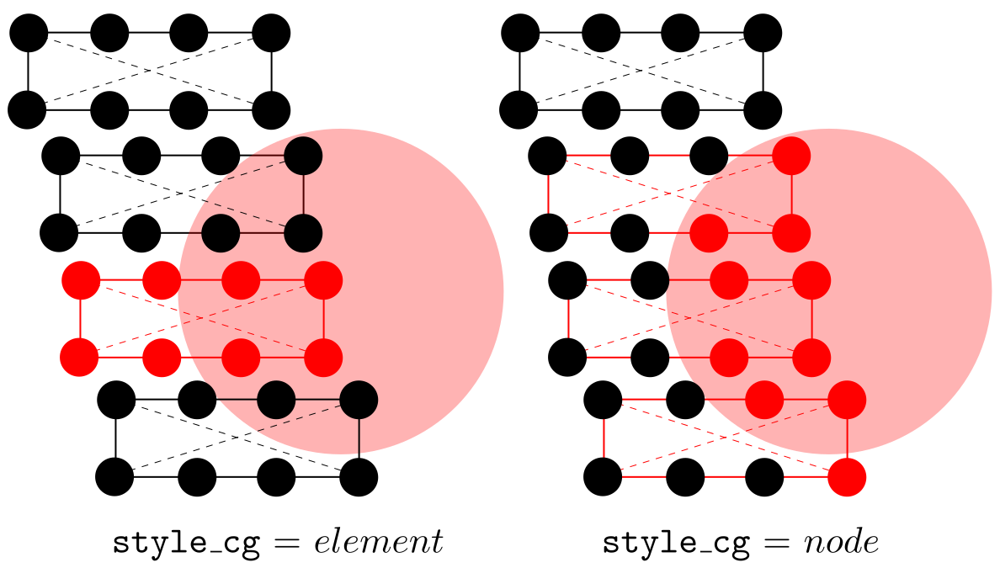

In the [group](../chapter-5/group.md) command, `style_cg` can be either _element_, _node_, or _null_.

For _element_, if the centroid of an element is inside or outside (depending on [`boolean_in`](../chapter-5/group.md)) `group_shape`, this element and all its nodes belong to the group.

For _node_, if some nodes of an element is inside or outside (depending on [`boolean_in`](../chapter-5/group.md)) `group_shape`, this element and these nodes belong to the group.

The difference between _element_ and _node_ is explained in the figure below, where red elements (solid lines) and nodes (small spheres) belong to the group (large sphere) with `group_shape` = _sphere_.

