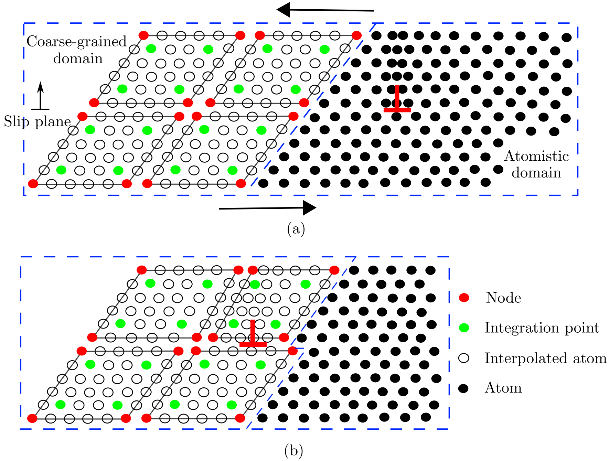

# Introduction

The concurrent atomistic-continuum \(CAC\) method is a partitioned-domain multiscale modeling technique that is applicable to nano/micro-scale thermo/mechanical problems in a wide range of monatomic and polyatomic crystalline materials. A CAC simulation model, in general, partitions the simulation cell into two domains: a coarse-grained domain and an atomistic domain. Distinct from most concurrent multiscale methods in the literature, CAC employs a unified atomistic-continuum integral formulation with elements that have discontinuities between them; also, the underlying interatomic potential is the only constitutive relation in the system. As such, CAC admits propagation of displacement discontinuities (dislocations and associated intrinsic stacking faults) through a lattice in both atomistic and coarse-grained domains, as shown in the figure below.

<figure><figcaption>Figure 1. A 2-D CAC simulation domain consisting of an atomistic domain (right) and a coarse-grained domain (left) (<a href="http://dx.doi.org/10.1016/j.ijplas.2015.05.007">Xu et al.</a>). The atomistic domain is composed of atoms (black circles), which follow the same governing equations in the atomistic simulation. The coarse-grained domain consists of discontinuous elements of varying size, each of which contains a large number of underlying atoms with the nodes (red circles) as the only degrees of freedom. Only the force/energy on integration points (green circles) and nodes are calculated. In (a), an edge dislocation (red $$\perp$$) is located in the atomistic domain. Upon applying a shear stress on the simulation cell, the dislocation migrates into the coarse-grained domain in (b), where the Burgers vector spreads out between discontinuous elements.</figcaption></figure>

<figure><figcaption>Figure 2. In 3-D, elements have faces on {111} planes and {110} planes in an FCC and a BCC lattice, resepectively. The positions of atoms within each element (open circles) are interpolated from the nodal positions (red filled circles).</figcaption></figure>

 
In a (big) nutshell, CAC

* describes certain lattice defects and their interactions using fully resolved atomistics;
* preserves the net Burgers vector and associated long range stress fields of curved, mixed character dislocations in a sufficiently large continuum domain in a fully 3D model;
* employs the same governing equations and interatomic potentials in both domains to avoid the usage of phenomenological parameters, essential remeshing operations and _ad hoc_ procedures for passing dislocation segments between the atomistic and coarse-grained domains.