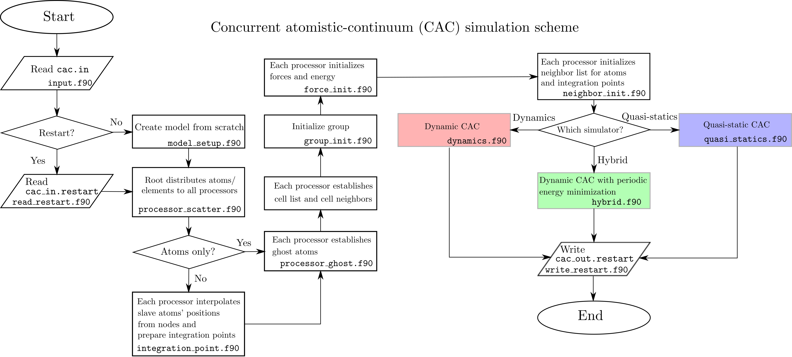
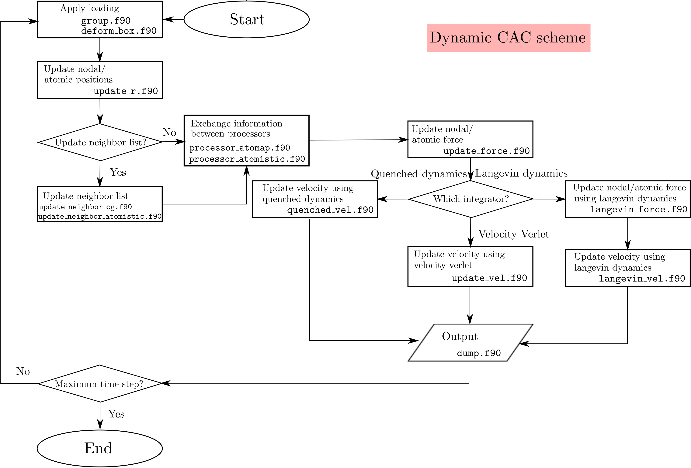
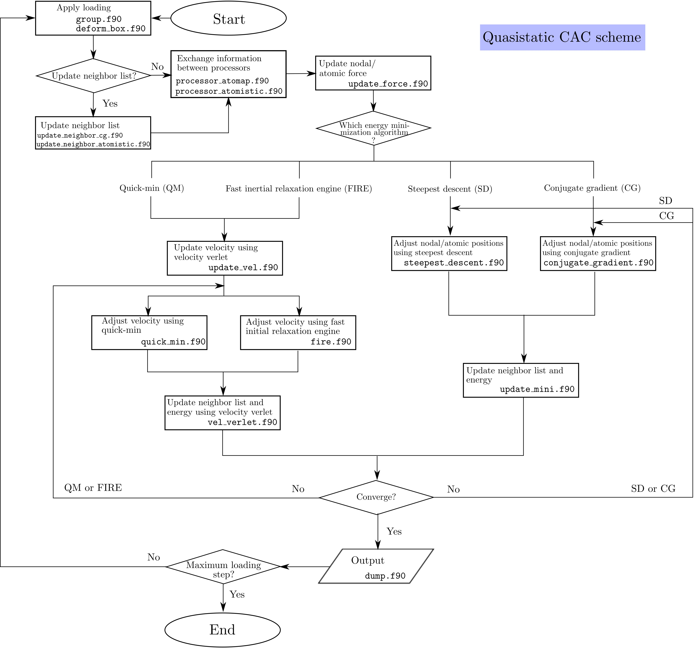

## Subroutine

In PyCAC, there are one main program (`main.f90`) and 170 subroutines (`*.f90`) in the `src` directory. Error messages are issued when

	call mpi_abort(mpi_comm_world, 1, ierr)

is triggered; the program is stopped immediately.

A flowchart of the CAC simulation algorithm based on [spatial decomposition](parall.md) is presented below:

The dynamic CAC scheme is

The quasistatic CAC scheme is

