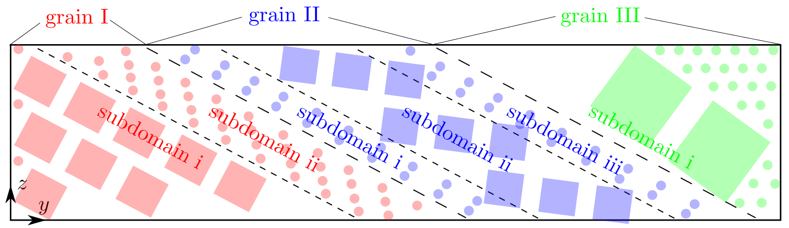

## subdomain

### Syntax

	subdomain {grain_id subdomain_number}

* `grain_id`, `subdomain_number` = positve integer

### Examples

	subdomain {1 1}
	subdomain {1 2} {2 3}
	subdomain {1 1 2 1 3 1}

### Description

This command sets the number of subdomains in each grain. Note that the curly brackets `{` and `}` in the syntax/examples are to separate different grains, the number of which is [`grain_number`](grain_num.md); all brackets should not be included in preparing `cac.in`.

In CAC, a unit is either the primitive unit cell of the lattice (for the atomistic domain) or a finite element (for the coarse-grained domain). Finite elements of different sizes are different types of unit. In a CAC simulation cell, each spatial region consisting of the same type of unit is a subdomain, as illustrated in the figure below:

Note that in this figure, the atoms in subdomain i/grain I and subdomain i/grain III are to fill in the otherwise jagged interstices, because either [`boolean_y`](zigzag.md) = _f_ or [`y`](boundary.md) = _p_.

The size of each subdomain and the unit type in each subdomain in each grain is specified in the [unit_num](unit_num.md) and [unit_type](unit_type.md) commands, respectively. The subdomains are stacked along a prescribed [`direction`](grain_dir.md). The three examples above correspond to the three examples in the [unit_num](unit_num.md) and [unit_type](unit_type.md) commands:

* In the first example, there is one grain designated by the first _1_, which has one subdomain designated by the second _1_.
* In the second example, there are two grains: the first grain has two subdomains designated by the first _2_, the second grain has three subdomains designated by _3_.
* In the third example, there are three grains, each of which has one subdomain, designated by the second _1_, the third _1_, and the fourth _1_, respectively.

The maximum `grain_id` must be larger than or equal to [`grain_number`](grain_num.md). All information related to `grain_id` that is larger than `grain_number` is discarded.

### Related commands

In the [unit_num](unit_num.md) and [unit_type](unit_type.md) commands, the maximum `subdomain_id` in each grain must equal the corresponding `subdomain_number`.

This command becomes irrelevant when [`boolean_restart`](restart.md) = _t_.

### Related files

`box_init.f90`

### Default

	subdomain 1 1
