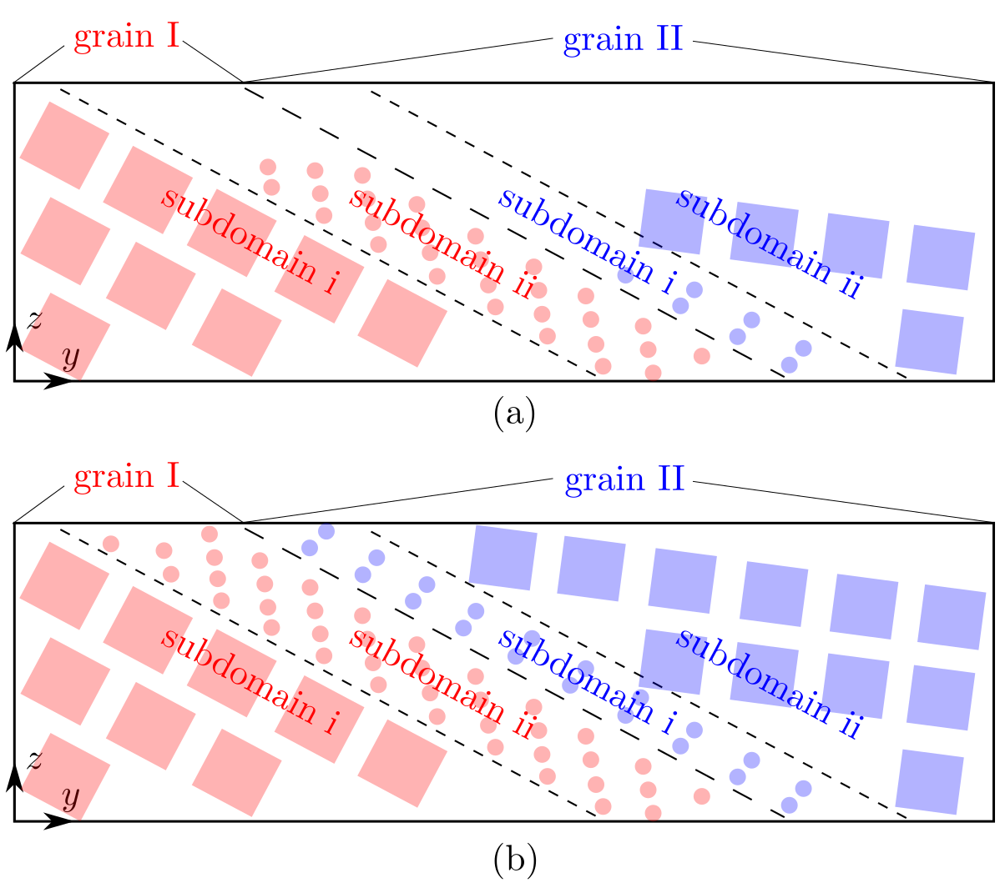

## unit_num

### Syntax

	unit_num {grain_id [subdomain_id x unit_num_x y unit_num_y z unit_num_z]}

* `grain_id`, `subdomoain_id` = positive integer

* `unit_num_x`, `unit_num_y`, `unit_num_z` = positive integer

### Examples

	unit_num {1 [1 x 2 y 3 z 4]}
	unit_num {1 [1 x 8 y 20 z 12] [2 x 40 y 2 z 60]} {2 [1 x 40 y 1 z 60] [2 x 8 y 25 z 12] [3 x 6 y 7 z 10]}
	unit_num {1 [1 x 2 y 3 z 4]} {2 [1 x 6 y 1 z 2]} {3 [1 x 10 y 2 z 3]}

### Description

This command sets the size of each subdomain along three directions in each grain. The `unit_num_x`, `unit_num_y`, and `unit_num_z` are in unit of the `x`, `y`, and `z` length of the projection of the [unit](unit_type.md) (primitive unit cell in the atomistic domain or the finite element in the coarse-grained domain) on the `yz`, `xz`, and `xy` planes, respectively.

Similar to the [unit_type](unit_type.md) command, this command consists of two loops. The outer loop, illustrated by `{}`, is based on grain; the inner loop, illustrated by `[]`, is based on subdomain. Note that the curly brackets `{` and `}` as well as the square brackets `[` and `]` in the syntax/examples are to separate different grains and subdomains, the number of which are [`grain_number`](grain_num.md) and [`subdomain_number`](subdomain.md), respectively; all brackets should not be included in preparing `cac.in`.

When [`grain_number`](grain_num.md) > 1 and/or [`subdomain_number`](subdomain.md) > 1, the size of each subdomain set directly by this command is most likely not the same, which may be problematic in some cases, e.g., in a bicrystal, as shown in Fig. (a) below, in which the subdomain i/grain I has a larger _z_ length than the other subdomains. Since the [grain stack direction](grain_dir.md) is _y_, the size of all other subdomains along the _x_ and _z_ directions will be increased to match that of the subdomain i/grain I, respectively, as shown in Fig. (b) below.

The three examples above correspond to the three examples in the [subdomain](subdomain.md) command.

The maximum `grain_id` must be larger than or equal to [`grain_number`](grain_num.md). All information related to `grain_id` that is larger than [`grain_number`](grain_num.md) is discarded. Within each grain, the maximum `subdomain_id` must equal the corresponding [subdomain_number](subdomain.md).

### Related commands

This command becomes irrelevant when [`boolean_restart`](restart.md) = _t_, in which case there is no need for the subdomain information.

### Related files

`box_init.f90` and `model_init.f90`

### Default

None.