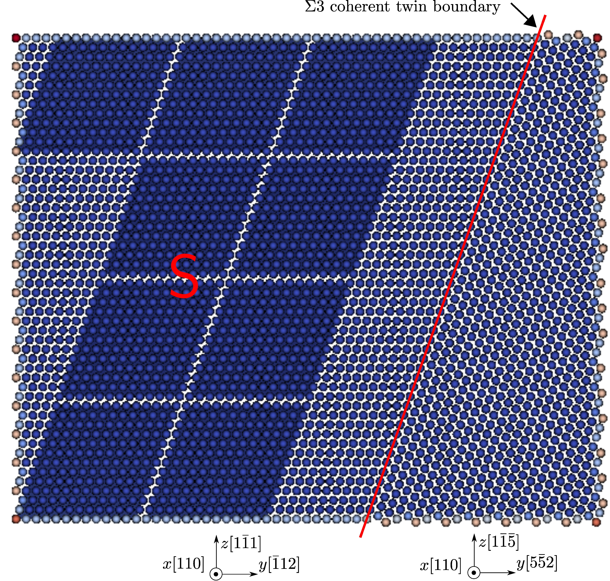

## Dislocation/coherent twin boundary interactions

FCC Cu, [Mishin EAM potential](http://dx.doi.org/10.1103/PhysRevB.63.224106), 2197 atoms per element in the coarse-grained domain. Results using larger models and/or in other metals are published in [Xu et al., 2016](http://dx.doi.org/10.1038/npjcompumats.2015.16) and [Xu et al., 2017](http://dx.doi.org/10.1007/s11837-017-2302-1).

In the figure below, the atoms that fill in the jagged interstices are not shown for a better visualization of the elements. In the Langevin dynamic simulation, a screw dislocation on the $$(1\bar{1}1)$$ plane is first created; then subject to a $$\gamma_{zx}$$ simple shear strain, the dislocation moves toward and is then transmitted across the $$\Sigma 3$${111} coherent twin boundary.

The movie below and the <a href="dislocation-ctb.log" target="_blank">log file</a> are produced using the <a href="dislocation-ctb.in" target="_blank">input file</a> and rendered by [OVITO](../../chapter6/ovito.md):

<video width="600" controls>
  <source src="dislocation-ctb.mp4" type="video/mp4">
</video>